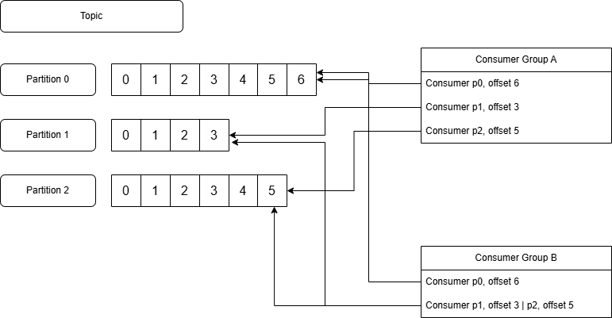

# Kafka Introduction

Kafka has to support 3 features:

 * You can publish/write data and subscribe/read data
 * You can store events/messages/records/data as long as you want. Use replication and other features. It's reliable as any other database
 * You can process those events as soon as they arrive or later in time. 

All this functionality is provided as a distributed, scalable, elastic, fault tolerant, secure

## Kafka Event

When you read or write data to kafka you do so in the form of events. An event has

 * key
 * value
 * headers (metadata)
 * Timestamp
 * Partition and offsetId

For example 

 * key => John
 * value => Added Iphone 15 Max to the cart
 * headers => "systemId" = "1234"
 * Timestamp => 2023-06-12T09:20:11
 * Paritition/Offest => Added once message is written to a topic

Messages can have any format: string, json, avro, protobuf. 

For example, referred to the example before you can send to kafka something like this in json

{"customer": "John", "action": "Added Iphone 15 Max to the cart"}

Messages/ Records are stored as serialized bytes 

    Application (kafka producer) => Serializer => Topic (100010001) => Deserializer => Application (kafka consumer)

So the message is sent in the following way:

 * The Application (kafka producer) sent to Serializer *{"customer": "John", "action": "Added Iphone 15 Max to the cart"}*
 * The Serializer sent to the Topic *100010001*. So the serializer serialize the message BEFORE publish it to kafka
 * The Topic stores *100010001* and sent to Deserializer *100010001*
 * The Deserializer receives *100010001*, deserialize and sent to the Application (kafka consumer) *{"customer": "John", "action": "Added Iphone 15 Max to the cart"}*

Instead of Json you can use protobuf to reduce the size so following the example before:

    message Event {
        string customer = 1;
        string action =2;
    }

Now let's talk about best practice for choosing the right key. If the order of the message matters to me, then choosing the right key is important. 
For example you have an order and receive several status update ("prepared","shipped","delivered") about the same order in the following situation

Message: Order
 * key: 
 * value: 

Topic: Shipping
 * Partition 1
 * Partition 2
 * Partition 3

Now the cosumer MUST consume the Shipping in the correct order, it should not delivered before it is shipped. *Kafka preserved order within parition*. The way to achieve this is to use the same key for all those messages. For example the key 1234

Message: Order
 * key: 1234
 * value: "prepared", "shipped", "delivered"

Topic: Shipping
 * Partition 1 | { key: 1234, value: "prepared", offset: 0 } | { key: 1234, value: "shipped", offset: 1 } | { key: 1234, value: "delivered", offset: 2 }  
 * Partition 2 | underutilized partition
 * Partition 3 | underutilized partition

To automatically load balance the messages amnong all partitions the simplest way is to use the Null key

Message: Order
 * key: Null
 * value: "prepared", "shipped", "delivered"

 Topic: Shipping
 * Partition 1 | { key: Null, value: "prepared", offset: 0 }
 * Partition 2 | { key: Null, value: "shipped", offset: 0 }
 * Partition 3 | { key: Null, value: "delivered", offset: 0 }

In this way is rare the needs to resize the partition

## Kafka Topic

Think of kafka topic like a database table

Table: Shipping
Column_1       |  Column_2
order_id: 1234 |  status: prepared
order_id: 1234 |  status: shipped
order_id: 1234 |  status: delivered

Topics are always multi-producer and multi-consumer. Different consumer may have different offset. In kafka messages are not deleted after the consume, but you can have a retention period or retention size. 
*Kafka performance is constant with respect to data size*.

You can scale Topics horizontally increasing partitions

## Kafka Partitions

*A topic can have multiple partitions, but a partitions only belongs to a single Broker*. 

Why is kafka so fast? The foundation si built around paritioning. 

Kafka Topic:
 * Partition 0 |0|1|2|3|4|5|6|7|
 * Partition 1 |0|1|2|3|
 ...

A parition itself is a discrete log file written to the local kafka broker. A topic can be spread across multiple kafka brokers, but a partition always belongs to one broker. For example you can scale your topic to 9 paritions across 3 brokers (3 per broker). This way you're not limited to a single broker I/O. If you need to hanle millions of messages per second it's not a big deal for kafka. Just scale the number of partitions and increase the number of consumers. In many cases you want to scale your application to the same number of partitions. For instance, if you have 9 paritions, you can set the replica count for your application to 9 as well.  

Reader of a given partition consumes messages in the order they published. Kafka can REPLICATE your partitions across different brokers. The best practice for production is to set replciation to 3. So you would have a producer that directly writes to a specific broker partition, and then the kafka cluster will reproduce your partition in differen brokers. We call the original parition 'parition leader'. Both producers and consumers use the parition leader. Now if that broker fails the kafka controller reassigns the leader for that parition to a different broker and redirects producers and consumers to use a different broker. This is why kafka is fault tolerant, also high-availability means that immediately after a failure you'll be able to continue writing and reading data without interruption. 

## Kafka Producers

Producers are applications that publish/write events to kafka. Producers distribute data to topics by selecting the appropriate partition within the topic. Typicall procucer distributes messagess acresoo all partitions of a topic. But the producer may direct messages to a particuilar partition in certain instances - for example to keep related events together in the same parition and in the exact order in which they were sent. The producer should take care to distribute keys roughly evenly across partiotions to avoid sending too much traffic to one particular broker, which could effect performance. 

## Kafka Consumers 

Consumers are application that subscribe to topics and process published messages. A consuimer uses offset to track which messages it has already consumed. A consumer stores the offset of the last consumed message for each partition so it can stop and restart without losing its place. Consumers interact with a topic as a GROUP. This enables scalable processing. The group ensures that 1 member only consumes 1 partition 

If one consumer fails the reminaing members reorganize consumed partitions to compensate for the absent member.

## Cluster Architecture

Kafka is a distributed system consisting of multiple servers. Traditionally, kafka relied on Zookeeper to elect a kafka controller, maintain cluster membership, manage topic configurations and perform some othe functions. Zookeper is also a distributesd system and in production environment you would also be required to deploy and maintain a 3 or 5 node cluster. However kafka can be run in kraft mode where zookeper is no longer necessary. 

## Kafka Broker

A kafka broker is a single kafka server. Kafka brokers receive messages from producers, assign them offsets and commit the messages to storage. Now an offset is a unique integer value that kafka increments and adds to each message as it's published. Offsets are unique for each partition and are critical maintaining data consistency in the vent of a failure. For example, if the consuemr fails and when it's restarted, it will returned to the last consumed message. At least, that's the default behaviour. 

## Kafka Controller

Every kafka cluster has a single active kafka controller. It is responsible for manging partitions and replicas and performing some administrative tasks such as reassingning partitions. For example if one kafka broker groes down with the partition leader, the active controller will reassiogn this function to another broker that already has all the replicated data to act as a partition leader and serve data. The controller service runs on every broker in a kafka cluster, but only one broker can be active at any point in time. It used to be managed and elected by zookeeper, but in the new version it is elected internally using the raft protocol.